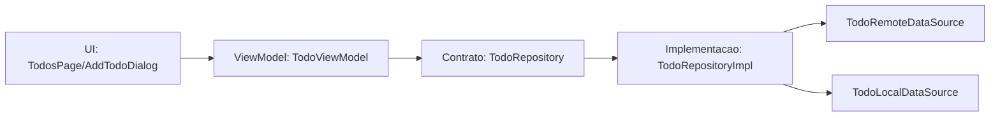

# ARCH — Arquitetura após refatoração

## Estrutura final

```text
lib/
	core/
		errors/
			app_error.dart
	features/
		todos/
			data/
				datasources/
					todo_local_datasource.dart
					todo_remote_datasource.dart
				models/
					todo_model.dart
				repositories/
					todo_repository_impl.dart
			domain/
				entities/
					todo.dart
				repositories/
					todo_repository.dart
			presentation/
				pages/
					todos_page.dart
				viewmodels/
					todo_viewmodel.dart
				widgets/
					add_todo_dialog.dart
	main.dart
	ui/
		app_root.dart
```

## Fluxo de dependências



Resumo do fluxo principal:
UI aciona ações no ViewModel, o ViewModel delega para o contrato de repositório, e a implementação do repositório escolhe quando usar fonte remota/local para entregar os dados à camada de apresentação.

## Justificativa da estrutura

- Organização por feature: todo o código de TODO ficou coeso dentro de features/todos.
- Separação por camadas: domain define entidades e contratos; data implementa acesso a dados; presentation contém estado e UI.
- Baixo acoplamento: o ViewModel depende de abstração (TodoRepository), não da implementação concreta.
- Evolução facilitada: novas features seguem o mesmo padrão sem misturar arquivos globais por tipo.

## Decisões de responsabilidade

- Validação: permanece no ViewModel (ex.: título vazio em addTodo), como regra de entrada de estado da tela.
- Parsing JSON: permanece no model da camada data (TodoModel.fromJson/toJson).
- Erros: capturados no ViewModel e expostos por estado (errorMessage), sem dependência de BuildContext/Widget no ViewModel.
- Escolha remoto/local: centralizada no repositório (fetch remoto + persistência/leitura de lastSync local).
